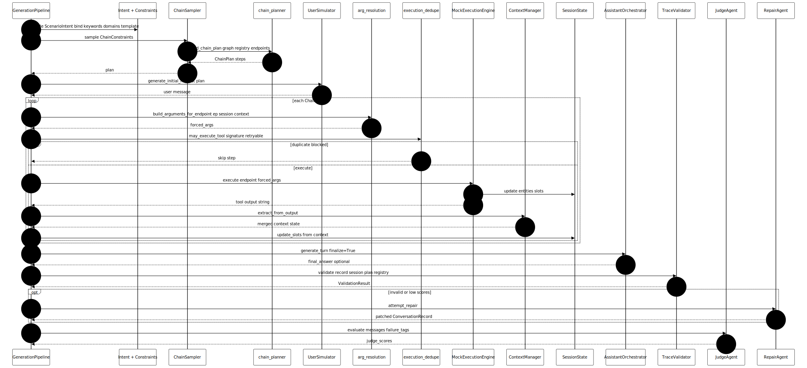

# How the diagrams map to reality

This page walks through the two architecture figures in plain language. When we say **“the model”** here, we mean the **whole synthetic pipeline**: typed tools, graph planning, mock APIs, optional LLM agents, and the checks that decide whether a conversation is good enough to keep—not a single neural net doing everything at once.

Read the pictures alongside this text: they are the same flow, just drawn as a **conversation between boxes** (sequence) and a **decision journey** (state machine).

---

## Figure 1 — Strict plan execution (one trace)

*Source: [`diagrams/strict-plan-sequence.mmd`](diagrams/strict-plan-sequence.mmd)*

### What this diagram is trying to show

Imagine **one row of a dataset**: one user intent, one ordered list of tool endpoints, one transcript. The sequence diagram is the **script** that row follows when **strict plan execution** is on (`STRICT_PLAN_EXECUTION` in `config.py`). In that mode, the pipeline does not “wing it” tool-by-tool from free-form model creativity alone; it **commits to a plan** and then **walks it**, filling arguments from real (mock) state so IDs and slots line up.

### The cast (who is who)

- **GenerationPipeline** — the conductor. It owns the loop, the history list, metadata, and when to call everything else.
- **Intent + Constraints** — not a separate Python class on the diagram: it is the **scenario** you sampled (trip planning, finance, etc.) plus knobs like domains and keywords, copied onto `ChainConstraints` before planning.
- **ChainSampler** — a thin door into **chain_planner**, which actually decides the ordered endpoints.
- **chain_planner** — the “structural brain”: templates and/or graph walk, outputting a **`ChainPlan`** (ordered `ChainStep`s).
- **UserSimulator** — writes the opening user message so the trace feels like a dialogue, grounded in the plan.
- **arg_resolution** — turns “what does this endpoint need?” into a concrete dict using session slots, extracted context, and safe defaults.
- **execution_dedupe** — asks: “have we already run this exact endpoint with these exact args?” If yes, the step is skipped unless the plan marked it **retryable** (rare follow-up pattern).
- **MockExecutionEngine** — pretends to be the real world: returns stringy, schema-ish results and updates structured **entity** / slot state.
- **SessionState** — long-lived memory for IDs and extracted fields across steps.
- **ContextManager** — parses tool output strings into a flatter bag of keys/values the next argument builder can see.
- **AssistantOrchestrator** — here it appears at the **end** for `finalize=True`: optional closing natural-language answer after tools ran. In strict mode the heavy lifting is already done; the orchestrator wraps the story.
- **TraceValidator** — rule-based auditor: duplicates, domain fit, plan adherence, hallucinated IDs, etc.
- **RepairAgent** — an LLM-backed “editor” pass when validation complains (diagram shows one repair branch; the code may also repair again after the judge—see below).
- **JudgeAgent** — scores the transcript on rubrics like tool correctness and task completion.

### Step by step (follow the numbers in the diagram)

1. **Pick the story** — The pipeline chooses an intent and copies its description, domains, positive/negative keywords, and a workflow template hint into the constraints object. That is the “world” this trace must live in.

2. **Ask for a plan** — The sampler forwards those constraints to the planner. The planner returns an ordered list of endpoints—your **chain**—that should read as a believable mini-workflow (search → book, budget → expenses → savings, and so on).

3. **Open the chat** — The user simulator writes the first message using the plan as context. You now have a normal-looking chat history with a user turn.

4. **The tool loop** — For each planned step:
   - **Resolve arguments** — Pull from context and session so, for example, a `hotel_id` is not invented mid-air if a prior step produced one.
   - **Dedupe gate** — Skip useless repeats of the same call with the same payload (unless the step is explicitly retryable).
   - **Execute** — The mock engine runs the call, returns text, and updates entities/slots.
   - **Learn from output** — Context manager + session update so the **next** step sees new facts.

   This loop is why the system feels “grounded”: the **next** tool call is not drawn from thin air; it is fed by what the **last** tool claimed happened.

5. **Finalize** — The assistant orchestrator may emit a short closing message that summarizes or responds to the user, using the same history the judge will later read.

6. **Validate** — Hard checks run. If something is structurally wrong, you get a repair pass instead of silently shipping garbage.

7. **Optional repair** — If validation failed, the repair agent tries to rewrite the transcript or metadata to fix tagged issues.

8. **Judge** — A separate scoring pass (often another model or mock) grades quality. In the real pipeline, **very low judge means can trigger another repair** after this step— the diagram keeps one repair block for clarity, but mentally allow a second pass.

**Takeaway:** this figure is the **honest story of strict mode**: structure first (plan), then **deterministic-ish execution** (args + mock + memory), then **language** (user + finalize), then **quality** (validate + judge + optional repair).

---

## Figure 2 — Per-sample quality gate (retries and accept)

*Source: [`diagrams/quality-gate-statemachine.mmd`](diagrams/quality-gate-statemachine.mmd)*

### What this diagram is trying to show

If Figure 1 is **one lap around the track**, Figure 2 is **whether we keep the lap or run another**. The pipeline does not always accept the first attempt. It behaves like a tiny **review loop**: simulate, package, analyze, validate, judge, maybe repair, maybe throw the whole thing away and try another intent/plan combo until retries are exhausted.

### Walk through the states in human terms

**Pick intent**  
“We are generating sample *k* of *N*.” The system draws a scenario (trip, finance, …) and attaches its rules to the constraints.

**Sample plan**  
Under those rules, the planner proposes a chain. If the registry is tiny or domains are tight, this might be a short chain; if multi-tool pacing is on, the planner tries to honor richer plans.

**Simulate (nested box)**  
This is Figure 1 folded into one blob:

- **User turn** — Seed the transcript.
- **Tool loop** — Resolve args → dedupe → mock execute → refresh context, until the plan is exhausted or steps are skipped as duplicates.
- **Finalize assistant** — Optional closing assistant message.

So far, nothing is “saved”—it is all in memory.

**Build record**  
The raw message list becomes a **`ConversationRecord`**: messages plus rich **metadata** (endpoints used, tool counts, intent name, strict flag, duplicate skips, etc.).

**Analyze quality**  
Lightweight signal extraction (e.g. diversity hints) runs on the record so metadata is honest before heavier checks.

**Validate**  
Rule-based pass/fail. Think of it as a linter for conversations: “Did we actually call tools?” “Did we repeat the same useless call?” “Does this endpoint even match the intent’s negative keywords?”

- If **failures are repairable**, you drop into **Repair** and come back to **Validate**—the loop means “fix, then re-audit,” not “hope nobody notices.”
- If **failures are fatal** (example: zero tool calls), the trace is not worth patching; you go to **Regenerate** and spend another inner-retry attempt with a fresh intent/plan roll.

**Judge**  
Subjective-ish scores on top of structure. If scores are embarrassing, the code can send you through **Repair** again (diagram shows judge → repair as an optional path).

**Accept**  
The trace survived. **CorpusUpdate** logs steering statistics (when enabled) so future samples can prefer variety—today that is mostly bookkeeping with hooks for stronger steering later.

**Terminal**  
The row is appended to your **JSONL** file. That is the artifact you ship to benchmarks, fine-tuning, or your portfolio.

**Regenerate**  
The inner retry loop bumps back to **Pick intent**: new scenario, new plan roll, clean session—because the previous transcript was not acceptable.

**Takeaway:** this figure answers “what happens when generation is flaky?” It shows the product decision: **bad traces are discarded or repaired**, not mixed into the dataset by default.

---

## How the “model” fits together (mental model)

- **Deterministic spine** — Registry, graph, planner, mock engine, dedupe, and validator are **code and data**. They do not “guess”; they enforce shape.
- **Stochastic seasoning** — Which intent, which template branch, which random-walk path, and (if you use real APIs) LLM wording—all of that adds variety.
- **LLM as specialist** — User voice, assistant phrasing, repair edits, and judge scores are **delegated** to agents so the core trace stays coherent.

So when you explain this project to someone: **it is not “one model chats and invents tools.”** It is **a small system** where models (or mocks) play **roles** inside guardrails—exactly what the two diagrams are drawn to communicate.

---

## Related files

| Topic | Location |
|--------|-----------|
| Main generation loop | `src/synthetic_tooluse/generation/pipeline.py` |
| Strict execution flag | `src/synthetic_tooluse/config.py` |
| Diagram sources | `docs/diagrams/*.mmd` |
| Rendered images | `docs/images/*.svg` |
| Regenerate B&W SVGs | `./docs/diagrams/render-bw.sh` |

Back to the diagram index: [README.md](README.md).
